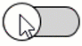
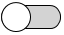
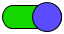
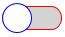

# WPF Switch button


Cette librairie contient un contrôle WPF permettant à l'utilisateur d'activer / désactiver des éléments (de la même manière qu'une Checkbox) mais avec un bouton commutateur.



# Démarrage rapide
- Créez un nouveau projet WPF
- Référencez le dll **AdmanDev.Switch**
- Ajoutez la référence XAML
<code>xmlns:sw="clr-namespace:Admandev.Switch;assembly=Switch"</code>
- Ajoutez le contrôle
	```xml 
	<sw:SwitchBox Name="switchBox"/>
	```

# Fonctionnalités

## Activer ou désactiver 

|  |  |
|--|--|
| Activé | Désactivé |

**Propriété:**
- La propriété <u>***Checked***  *(bool)*</u> permet d'activer ("cocher") ou désactiver ("décocher") l'élément.
	```xml 
	<sw:SwitchBox Checked="True"/>
	```
	*Valeur par défaut : <code>False</code>*

## Couleurs d'arrière-plan
Vous pouvez choisir une couleur d'arrière-plan de la partie rectangulaire du contrôle lorsqu'il est désactivé et une autre couleur lorsqu'il est activé. Vous pouvez également changer la couleur du bouton rond.

|  |  |
|--|--|
| Activé | Désactivé |

**Propriétés:**
- La propriété <u>***UncheckedBackground*** *(Brush)*</u> permet de choisir la couleur de la partie rectangulaire lorsque la propriété ***Checked*** est définie sur <code>False</code>.
	```xml
	<sw:SwitchBox UncheckedBackground="red"/>
	``` 
	*Valeur par défaut : <code>LightGray</code>*
	

- La propriété <u>***CheckedBackground*** *(Brush)*</u> permet de choisir la couleur de la partie rectangulaire lorsque la propriété ***Checked*** est définie sur <code>True</code>.
	```xml
	<sw:SwitchBox CheckedBackground="green"/>
	```
	*Valeur par défaut : <code>#0076d7</code>*


- La propriété <u>***SwitchBackground*** *(Brush)*</u> permet de choisir la couleur du bouton rond.
	```xml
	<sw:SwitchBox SwitchBackground="purple"/>
	```
	*Valeur par défaut : <code>white</code>*

## Couleurs des bordures
Il est possible de changer la couleur de la bordure de la partie rectangulaire et du bouton rond.



**Propriétés:**
- La propriété <u>***RectBorder*** *(Brush)*</u> permet de choisir la couleur de bordure de la partie rectangulaire.
	```xml
	<sw:SwitchBox RectBorder="red"/>
	```
	*Valeur par défaut : "black"*

- La propriété <u>***SwitchBorder*** *(Brush)*</u> permet de choisir la couleur de bordure du bouton rond.
	```xml
	<sw:SwitchBox SwitchBorder="blue"/>
	```
	*Valeur par défaut : "black"*


## Événements

- L'événement ***CheckedChanged*** se déclenche lorsque la propriété ***Checked*** est modifiée.
	```xml
	<sw:SwitchBox CheckedChanged="SwitchBox_CheckedChanged"/>
	```
	
	L'événement appel une méthode dont la signature est la suivante :
	```csharp
	void SwitchBox_CheckedChanged(bool isChecked) { ... }
	```
	
	* *isChecked* : Détermine si l'élément est maintenant  activé ou désactivé. <br>Il s'agit de la nouvelle valeur de la propriété ***Checked***.

# Liens externes

## Faire un don
Pour me soutenir financièrement dans le développement de contrôles et logiciels gratuits, vous pouvez me faire un don. Même un don de 1€ me ferait extrêmement plaisir et m'encouragerait à continuer ce que je fais.

[Cliquez ici pour faire un don](https://www.admandev.fr/donate.php) 

## Mes réseaux
[Mon site web](https://www.admandev.fr)

[Ma chaîne YouTube](https://www.youtube.com/c/ADMANDev)

[Facebook](https://www.facebook.com/AdmanDev/)

[Twitter](https://twitter.com/AdmanDev)

[Discord](https://discord.gg/EQnKUb4)


